# wlfs - Large File Splitter
Split files into smaller chunks (64MB) and Rejoin them.

## How to Use
### Split
* Open the app
* Tap **browse** and select the file to split ( or type in the path )
* Tap **split**
* Share partfiles

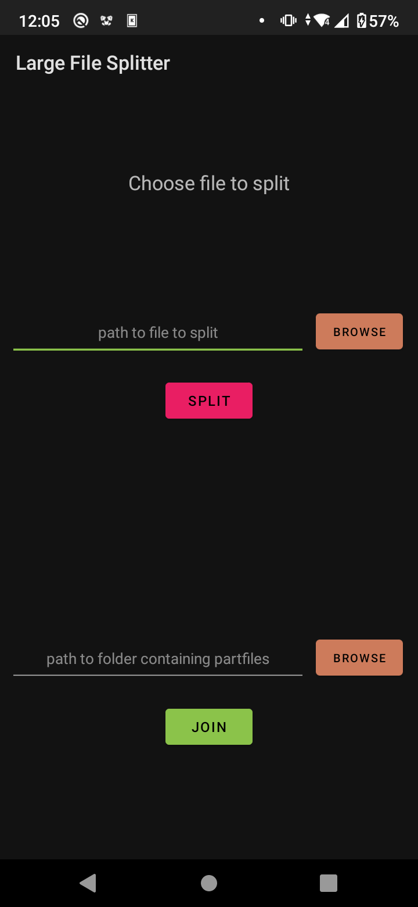 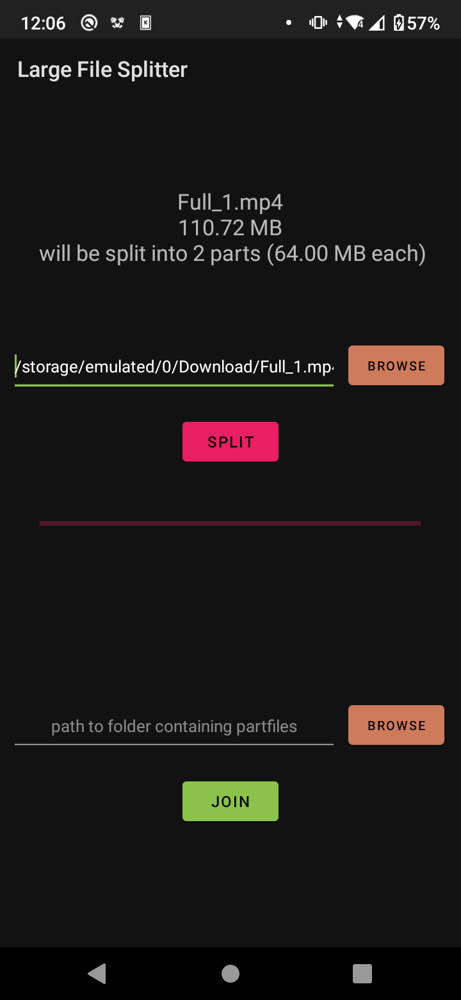 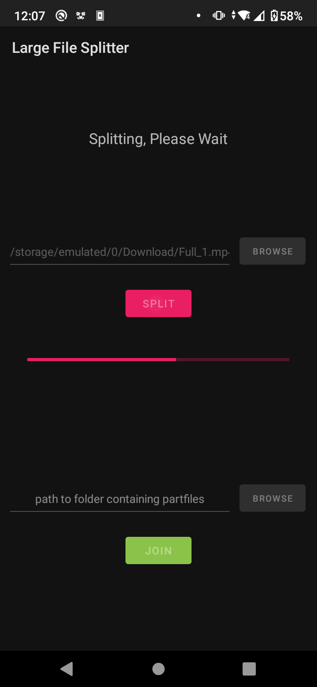 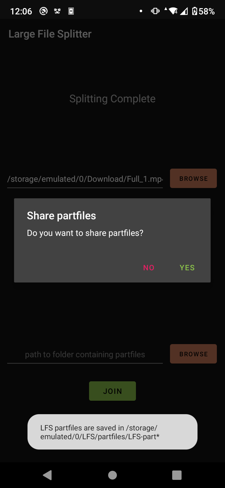 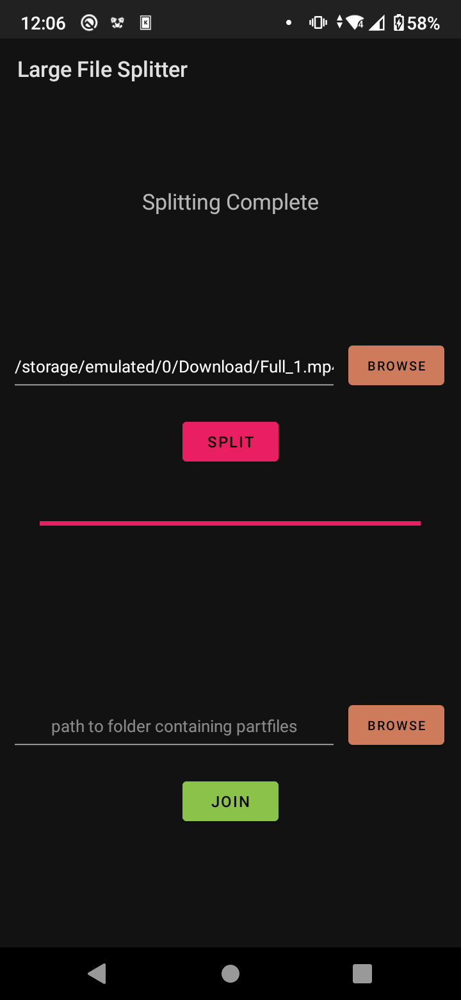

### Join
* Open the app
* Tap **browse** and select the folder where partfiles are present ( or type path )
* Tap **join**
* Delete partfiles after joining completes (recommended)

 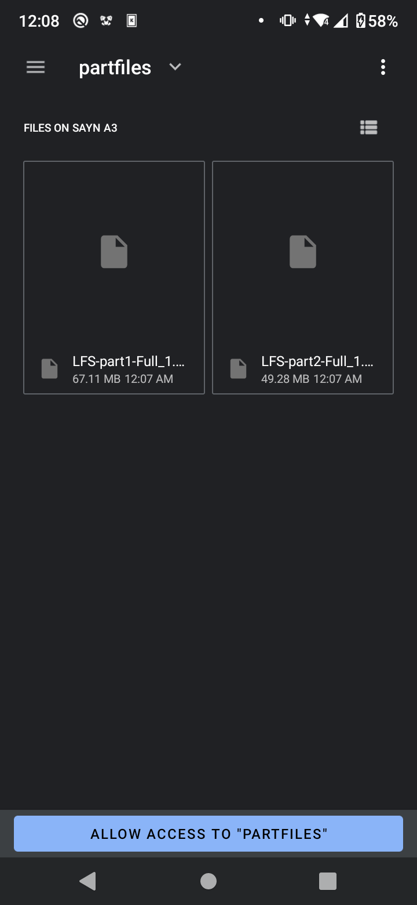 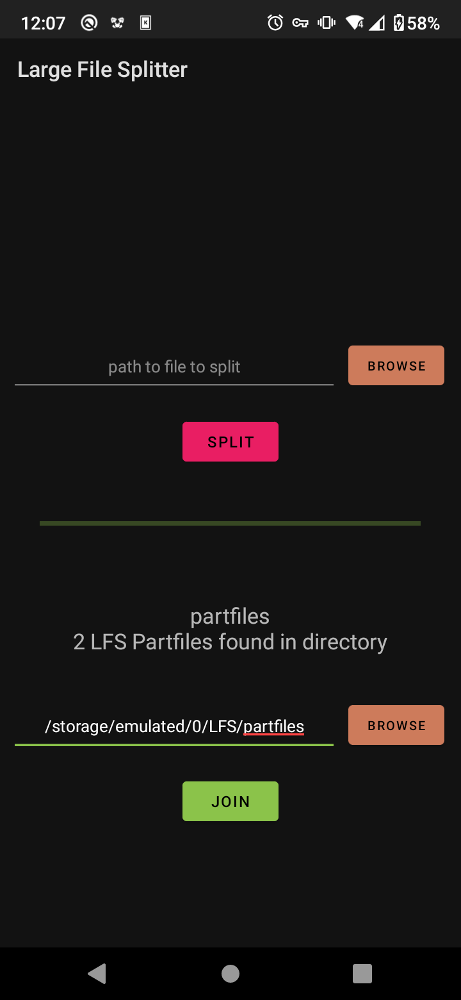 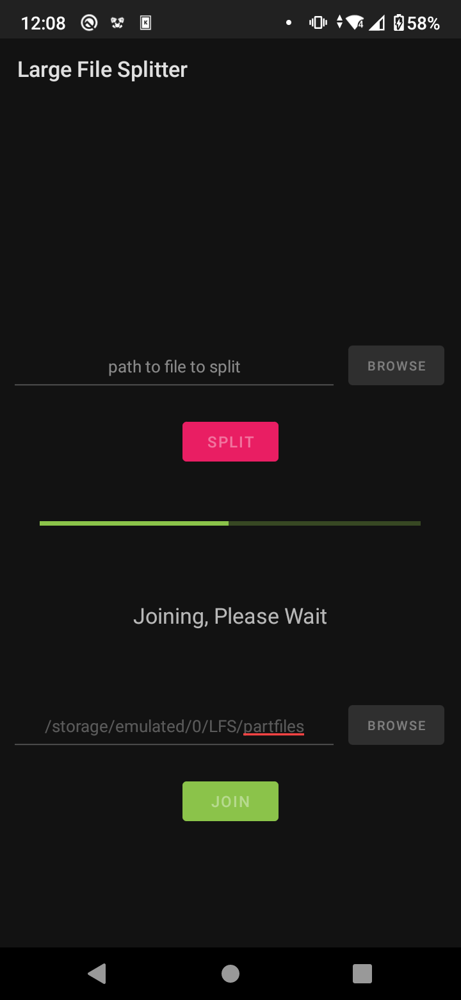 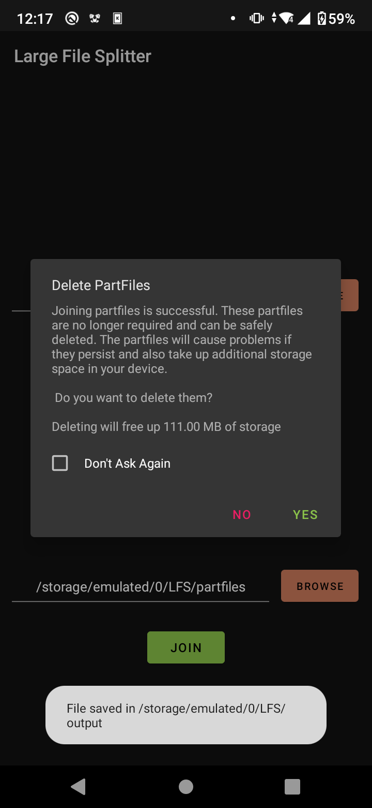 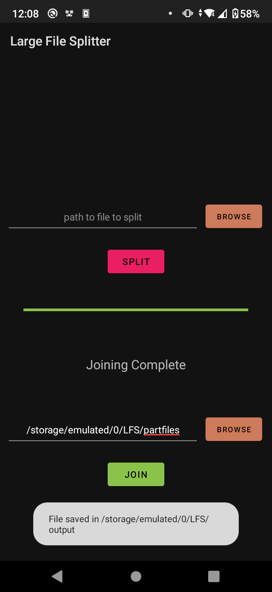

## Permissions

The app requires storage access permission in order to read/write files.

## Theme

The app uses the theme specified by the system. (light/dark)

## FAQ

#### How do I open files in internal storage?
After pressing `browse` and opening the default file manager, tap on the three dots on the top right corner and select 'Show internal storage' option. Now in the leftside menu the internal storage will be available.

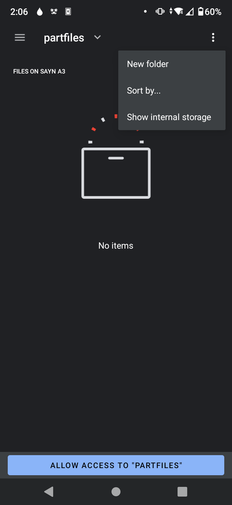

#### I am unable to open files with my file explorer
It is recommended to use the default android file explorer and select the file from internal/external storage.

#### Can I open a file to split using the app from my file explorer?
Yes! You can open a file from your file explorer using the app and it will be selected for splitting automatically.

#### Why does the progress bar change color? / What does the progress bar colors mean?
The progress bar color denotes what operation is currently going on, green means joining, pink means splitting.

#### How do I change the theme of the app? (light mode / dark mode)
The app uses the system theme. Change your system theme to light mode or dark mode to change the app theme.

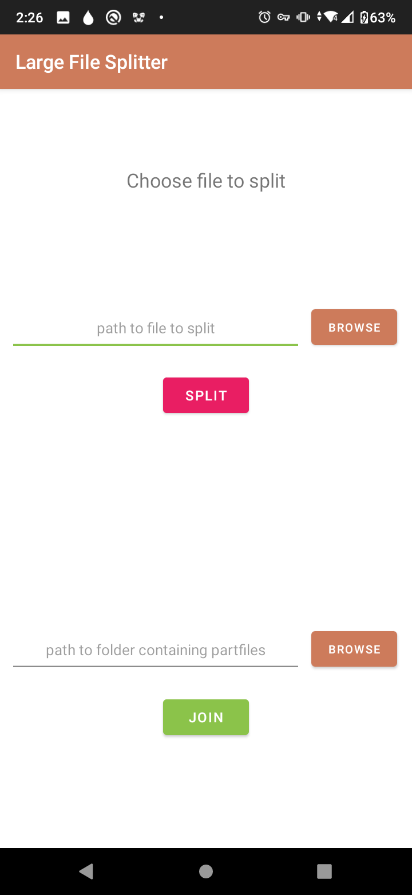 

#### Is this app made by whatsapp?
No. This app is made by an individual programmer and is not affiliated with WhatsApp in any way whatsoever.

#### How can I improve the app?
This project is open source and you can contribute to it by creating a pull request in the github repo.
